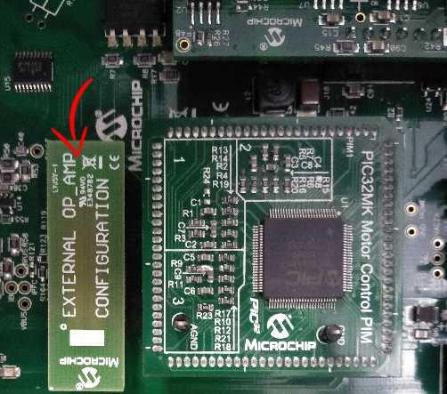
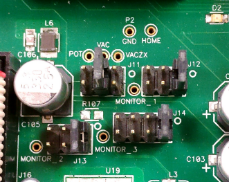
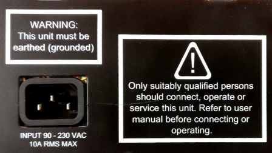
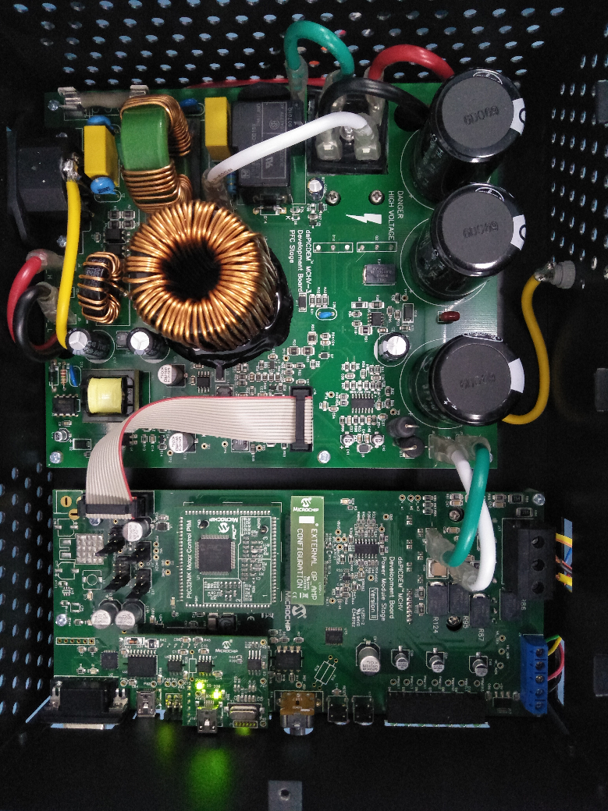

# MCHV3 Development Board
## Setting up the hardware

The following table shows the target hardware for the application projects.

| Project Name| Hardware |
|:---------|:---------:|
| mchv3_pic32mk_mcf_pim.X | [MCHV3 Development Board](https://www.microchip.com/developmenttools/ProductDetails/dm330023-3) [PIC32MK MCF Motor Plugin Module](https://www.microchip.com/developmenttools/ProductDetails/ma320024) [Leadshine EL5-M0400-1-24 Motor](https://www.microchip.com/developmenttools/ProductDetails/AC300025) 
|||

### Setting up [MCHV3 Development Board](https://www.microchip.com/developmenttools/ProductDetails/dm330023-3)

- Mount the PIC32MK MCF Motor Control Plug In Module on U11 header. 

    

- Place the "External Opamp Configuration" Matrix board at J4.

    

- Motor Connections: 
    - Phase U - M1 
    - Phase V - M2 
    - Phase W - M3

    
    
- Encoder Connections:
    - A+ : HA
    - B+ : HB
    - 5V : +5V
    - 0V : GND
    
    

- Jumper Settings: 
    - J11 - VAC ( Short Pin 3 - 4)
    - J12 - IA ( Short Pin 1 - 2)
    - J13 - IB ( Short Pin 1 - 2)
    - J14 - Fault_IP/IBUS ( Short Pin 1 - 2)

    

- Power the board with (110V/220V) AC mains. For additional safety, it is recommended to use a current limited power supply while testing this software demonstration on a non-default hardware and motor. 

    

- Complete Setup

    

## Running the Application

1. Build and Program the application using its IDE
2. Press switch PUSHBUTTON to start the motor
3. Vary potentiometer to change the speed of the motor
4. Press switch to stop the motor
5. Monitor graphs on X2C Scope

Refer to the following tables for switch and LED details:

| Switch | Description |
|------|----------------|
| PUSHBUTTON | To start or stop the motor |
||

| LED D2 Status | Description |
|------|----------------|
| OFF  | No fault  |
| ON   | Fault is detected  |
||