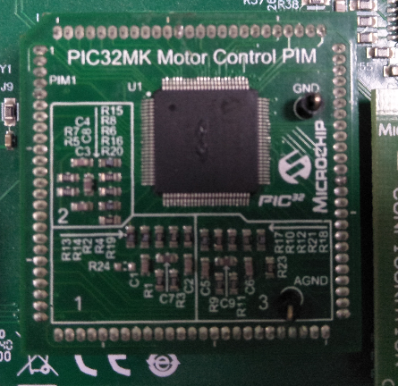
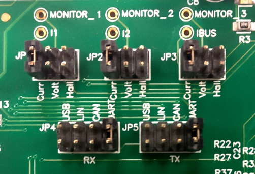

# MCLV2 Development Board
## Setting up the hardware

The following table shows the target hardware for the application projects.

| Project Name| Hardware |
|:---------|:---------:|
| mclv2_pic32mk_mcf_pim.X |[MCLV2 Development Board](https://www.microchip.com/DevelopmentTools/ProductDetails/DM330021-2)<br>[PIC32MK MCF Motor Plugin Module](https://www.microchip.com/developmenttools/ProductDetails/ma320024)<br>[EBM-PAPST ECI 6320-K1-B00 motor](https://ebmpapst.se/sv/dat/media_manager/news/696/news-files/Ext_38717.pdf) |

### Modify the [MCLV2 Development Board](https://www.microchip.com/DevelopmentTools/ProductDetails/DM330021-2)
- Modify the MCLV2 development board for higher current capability- TC1 modifications. Refer the [MCLV2 Development Board modification guide](http://ww1.microchip.com/downloads/en/DeviceDoc/motorBench-mclv2-modifications-guidelines.2.285.pdf) for more details.
  

### Setting up [MCLV2 Development Board](https://www.microchip.com/DevelopmentTools/ProductDetails/DM330021-2)

- Mount the PIC32MK MCF Motor Control Plug In Module on U9 header. 

    

- Place the "External Opamp Configuration" Matrix board at J14.

    

- Motor Connections: 
    - Phase U - M1 
    - Phase V - M2 
    - Phase W - M3

    

- Jumper Settings: 
    - JP1 - Curr, JP2 - Curr, JP3 - Curr 
    - In order to use RS232 port for X2CScope Communication JP4 - UART, JP5 - UART 
    - In order to use USB port for X2CScope Communication JP4 - USB, JP5 - USB

    


- Power the board with a 24V DC supply using J2 or BP1-BP2. For additional safety, it is recommended to use a current limited power supply while testing this software demonstration on a non-default hardware and motor. 

    


## Running the Application

1. Build and Program the application with ````src/pic32mk_mcf_zsmt_firmware.hex````using Microchip's IPE.
2. Press switch S2 to start the motor
3. Vary potentiometer to change the speed of the motor
4. Press switch S2 to stop the motor
5. Press switch S2 again to start the motor
6. Monitor graphs on X2C Scope

Refer to the following tables for switch and LED details:

| Switch | Description |
|------|----------------|
| Switch S2 | To start or stop the motor |


| LED D17 Status | Description |
|------|----------------|
| OFF  | No fault  |
| ON   | Fault is detected  |
