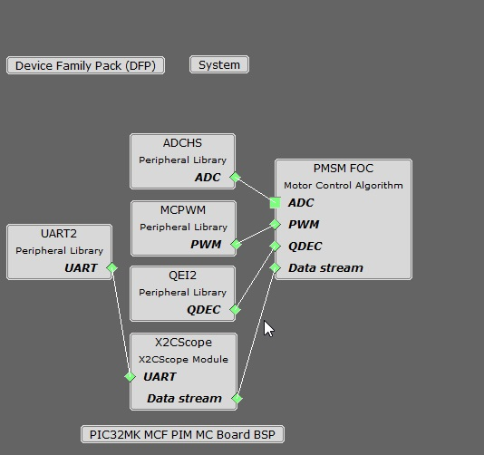

# PMSM FOC using Quadrature Encoder

This example application shows how to control the Permanent Magnet Synchronous Motor (PMSM) with Quadrature Encoder based Field Oriented Control (FOC) on a PIC32MK Micro-controller. 

## Description

Permanent Magnet Synchronous Motor (PMSM) is controlled using Field Oriented Control (FOC). Rotor position and speed is determined using Quadrature Encoder. Motor start/stop operation is controlled by the switch and motor speed can be changed by the on-board potentiometer. Waveforms and variables can be monitored runtime using X2CScope. 

Key features enabled in this project are:

- Dual shunt current measurement
- Speed control loop

## MHC Project Configurations

- **PMSM_FOC**: 

    This component configures FOC algorithm parameters, motor parameters and motor control board parameters. It connects to underlying peripheral libraries ADCHS and MCPWM. This components auto configures ADC channels and PWM channels as per PMSM_FOC component configurations. 
- **ADCHS Peripheral**: 

    The ADCHS is used to measure analog quantities. Four channels are used to measure the Phase Current U, the Phase Current V, the DC Bus Voltage and the Potentiometer. Conversion is triggered at the PWM (zero match + offset of the switch delay) 
- **MCPWM Peripheral**: 

    This peripheral is used to generated three phase synchronous PWM waveforms. Fault functionality is also enabled to switch off the output waveforms asynchronously.
- **QEI Peripheral**:
        
    This peripheral is used to decode the rotor position and speed from quadrature encoder signals.    
- **X2CScope**: 

    This component adds X2C scope protocol code. This uses UART to communicate to the host PC. X2CScope allows user to monitor variables runtime.
- **UART Peripheral**: 

    The UART is used for X2CScope communication to observe graphs and variable values in run time 

## Project Details
For details refer [Motor Control Plant](https://microchip-mplab-harmony.github.io/motor_control/algorithms/pmsm_foc/mc_plant_docs/introduction.md)

## Development Kits

### MCLV2 with PIC32MK Family Motor Control PIM
#### Downloading and building the application

To clone or download this application from Github, go to the [main page of this repository](https://github.com/Microchip-MPLAB-Harmony/mc_apps_pic32_mk) and then click **Clone** button to clone this repository or download as zip file.
This content can also be downloaded using content manager by following these [instructions](https://github.com/Microchip-MPLAB-Harmony/contentmanager/wiki).

Path of the application within the repository is **apps/mcp_pmsm_foc_encoder_pic32_mk** .

To build the application, refer to the following table and open the project using its IDE.

| Project Name            | Description                                    | Demo User Guide |
| ----------------------- | ---------------------------------------------- |--------------------|
| mclv2_pic32mk_mcf_pim.X | MPLABX project for MCLV2 board with PIC32MK MCF PIM |[MCLV2 with PIC32MK MCF PIM](../docs/mclv2_pic32mk_mcf_pim_sensored.md)|
| mclv2_pic32mk_mcm_pim.X | MPLABX project for MCLV2 board with PIC32MK MCM PIM |[MCLV2 with PIC32MK MCM PIM](../docs/mclv2_pic32mk_mcm_pim_sensored.md)|
||||
