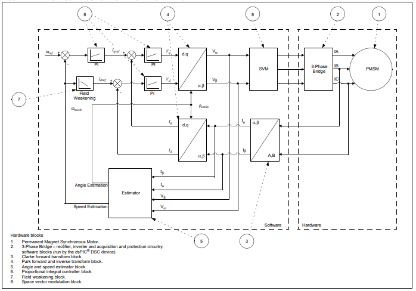

# PMSM FOC using PLL Estimator

This example application shows how to control the Permanent Magnet Synchronous Motor (PMSM) with PLL Estimator based Field Oriented Control (FOC) on a PIC32MK Micro-controller. 

## Description

Permanent Magnet Synchronous Motor (PMSM) is controlled using Field Oriented Control (FOC). Rotor position and speed is determined using PLL estimator technique. Motor start/stop operation is controlled by the switch and motor speed can be changed by the on-board potentiometer. Waveforms and variables can be monitored runtime using X2CScope. 

Key features enabled in this project are:

- Dual shunt current measurement
- Speed control loop
- Field weakening
- Flying Start Capability

## MHC Project Configurations

- **PMSM_FOC**: 

    This component configures FOC algorithm parameters, motor parameters and motor control board parameters. It connects to underlying peripheral libraries ADCHS and MCPWM. This components auto configures ADC channels and PWM channels as per PMSM_FOC component configurations. 
- **ADCHS Peripheral**: 

    The ADCHS is used to measure analog quantities. Four channels are used to measure the Phase Current U, the Phase Current V, the DC Bus Voltage and the Potentiometer. Conversion is triggered at the PWM (zero match + offset of the switch delay) 
- **MCPWM Peripheral**: 

    This peripheral is used to generated three phase synchronous PWM waveforms. Fault functionality is also enabled to switch off the output waveforms asynchronously.
- **X2CScope**: 

    This component adds X2C scope protocol code. This uses UART to communicate to the host PC. X2CScope allows user to monitor variables runtime.
- **UART Peripheral**: 

    The UART is used for X2CScope communication to observe graphs and variable values in run time 

## Control Algorithm

This section briefly explains the FOC control algorithm, software design and implementation. Refer to [Application note AN2520](https://www.microchip.com/wwwAppNotes/AppNotes.aspx?appnote=en599773) for the PLL estimator based sensor-less FOC technique in detail. 

Field Oriented Control is the technique used to achieve the decoupled control of torque and flux. This is done by transforming the stator current quantities (phase currents) from stationary reference frame to torque and flux producing currents components in rotating reference frame using mathematical transformations. The Field Oriented Control is done as follows: 

1. Measure the motor phase currents. 
2. Transform them into the two phase system (a, b) using the Clarke transformation. 
3. Calculate the rotor position angle. 
4. Transform stator currents into the d,q-coordinate system using the Park transformation. 
5. The stator current torque (iq) and flux (id) producing components are controlled separately by the controllers. 
6. The output stator voltage space vector is transformed back from the d,q-coordinate system into the two phase system fixed with the stator by the Inverse Park transformation. 
7. Using the space vector modulation, the three-phase output voltage is generated. 

**PLL estimator** :

This estimator uses PLL structure to estimate the rotor position and thus speed.  Its operating principle
is based on the fact that the d-component of the Back Electromotive Force (BEMF) must be equal to zero at
a steady state functioning mode. It can not estimate the rotor angle at 
lower rotor speeds because of very low back EMF. So, open loop startup is used till required minimum speed is achieved. 

The following block diagram shows the software realization of the FOC algorithm.

## Software Design

Please refer to [PMSM_FOC Library](https://microchip-mplab-harmony.github.io/motor_control/) for state machine, flow charts and detailed software design. 

## Development Kits

### MCLV2 with PIC32MK Family Motor Control PIM
#### Downloading and building the application

To clone or download this application from Github, go to the [main page of this repository](https://github.com/Microchip-MPLAB-Harmony/mc_apps_pic32_mk) and then click **Clone** button to clone this repository or download as zip file.
This content can also be downloaded using content manager by following these [instructions](https://github.com/Microchip-MPLAB-Harmony/contentmanager/wiki).

Path of the application within the repository is **apps/pmsm_foc_pll_estimator_pic32_mk** .

To build the application, refer to the following table and open the project using its IDE.

| Project Name            | Description                                    | Demo User Guide |
| ----------------------- | ---------------------------------------------- |--------------------|
| mclv2_pic32mk_mcf_pim.X | MPLABX project for MCLV2 board with PIC32MK MCF PIM |[MCLV2 with PIC32MK MCF PIM](../docs/mclv2_pic32mk_mcf_pim_sensorless.md)|
| mclv2_pic32mk_mcm_pim.X | MPLABX project for MCLV2 board with PIC32MK MCM PIM |[MCLV2 with PIC32MK MCM PIM](../docs/mclv2_pic32mk_mcm_pim_sensorless.md)|
||||

### MCHV3 with PIC32MK Family Motor Control PIM
#### Downloading and building the application

To clone or download this application from Github, go to the [main page of this repository](https://github.com/Microchip-MPLAB-Harmony/mc_apps_pic32_mk) and then click **Clone** button to clone this repository or download as zip file.
This content can also be downloaded using content manager by following these [instructions](https://github.com/Microchip-MPLAB-Harmony/contentmanager/wiki).

Path of the application within the repository is **apps/pmsm_foc_pll_estimator_pic32_mk** .

To build the application, refer to the following table and open the project using its IDE.

| Project Name            | Description                                    | Demo User Guide |
| ----------------------- | ---------------------------------------------- |--------------------|
| mchv3_pic32mk_mcf_pim.X | MPLABX project for MCHV3 board with PIC32MK MCF PIM |[MCHV3 with PIC32MK MCF PIM](../docs/mchv3_pic32mk_mcf_pim_sensorless.md)|
| mchv3_pic32mk_mcm_pim.X | MPLABX project for MCHV3 board with PIC32MK MCM PIM |[MCHV3 with PIC32MK MCM PIM](../docs/mchv3_pic32mk_mcm_pim_sensorless.md)|
||||

